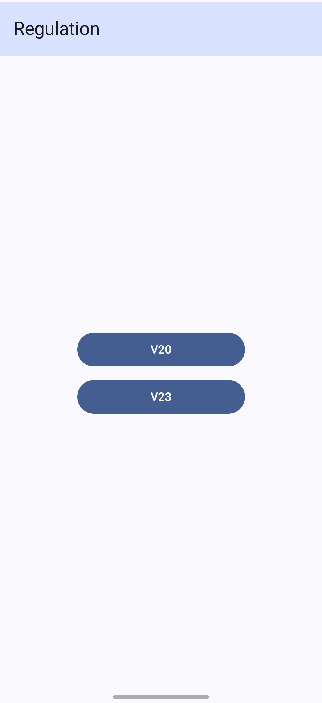
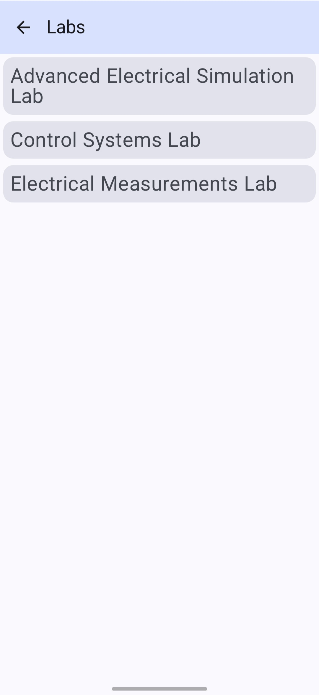
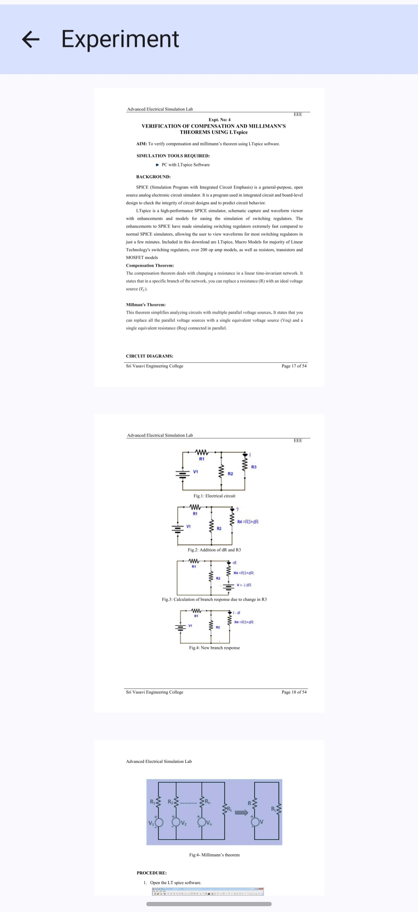

# Labmate


## Description
**Labmate** is an Android app designed for students and researchers to easily browse lab courses and their corresponding experiments. The app fetches a list of available lab courses, displays experiments related to each course, and allows users to download and view the experiment PDFs.

## Features
- **Lab Courses List**: Displays a lazy-loaded list of available lab courses.
- **Experiment Details**: Upon selecting a lab course, the user is presented with a list of experiments for that course.
- **PDF Download**: Users can download experiment PDFs directly to their device and view them seamlessly within the app.
- **Firebase Integration**: The app uses Firebase Firestore for data storage and Firebase Storage for managing and serving PDF files.
- **Clean Architecture**: Structured with Jetpack Compose for UI, ViewModel for lifecycle management, and modern Android libraries.

## Screenshots

## Screenshots

<p align="center">
    
    
    
</p>

<p align="center">
    
    
</p>


## Technologies Used
- **Programming Language**: Kotlin
- **UI Framework**: Jetpack Compose for building modern, reactive user interfaces.
- **Database**: Firebase Firestore for storing lab courses and experiments.
- **File Storage**: Firebase Storage for hosting and downloading PDFs.
- **Firebase Services**: Firebase Analytics for tracking user engagement, Firebase App Check for security, and Firebase Firestore & Storage for data management.
- **Architecture**: MVVM (Model-View-ViewModel) for clean code structure.
- **Dependencies**: 
  - **Jetpack Compose**: For UI components, navigation, and graphics.
  - **Firebase**: For Firestore, Storage, App Check, and Analytics.
  - **Navigation Component**: For in-app navigation between different lab courses and experiments.

## Installation Instructions
1. Clone the repository to your local machine:
   ```bash
   git clone https://github.com/KBLReddy/Labmate.git
   ## Installation Instructions

### 2. Open the Project in Android Studio
Ensure that you have Android Studio installed and set up correctly. Open the `Labmate` project in Android Studio.

### 3. Ensure Android SDK is Installed
Make sure the required Android SDK and Kotlin dependencies are up-to-date. Android Studio will notify you if any SDK components need to be installed or updated.

### 4. Firebase Setup
If you don’t have Firebase set up, follow these steps:

#### a. **Create a Firebase Project**
1. Go to the [Firebase Console](https://console.firebase.google.com/).
2. Create a new Firebase project.
3. Add Firebase to your Android app by following the steps provided in the Firebase Console.

#### b. **Download google-services.json**
1. After adding Firebase to your project, you'll be asked to download a `google-services.json` file.
2. Place this `google-services.json` file in the `app/` directory of your project.

#### c. **Enable Firebase Services**
1. In the Firebase Console, enable **Firestore** and **Firebase Storage** under the "Build" section of your Firebase project settings.
2. Follow any instructions on the Firebase Console to complete the setup for your Android project.

### 5. Build and Run the Project
Once Firebase is integrated, build and run the project on an Android Emulator or physical device using Android Studio. Android Studio will automatically fetch and sync the dependencies and enable you to run the app.

## Contributing

We welcome contributions! If you'd like to improve this app, feel free to fork the repository, make changes, and create a pull request. Ensure that you:

1. **Fork the Repository**  
   Create your own fork of the repository to work on.

2. **Create a Branch**  
   Create a new branch for your changes (e.g., `feature/awesome-feature`).

3. **Write Clear and Concise Commit Messages**  
   Follow a clear commit message format, for example:
   ```bash
   git commit -m "Fix UI issue in Lab Courses list"

4. **Open a Pull Request**
After making your changes, open a pull request explaining what changes you've made.
## Contact
For any questions or feedback, feel free to reach out:

**Email**: lakshmanqwerty@gmail.com  
**LinkedIn**: https://www.linkedin.com/in/lakshman-karri-77341a1b4/


   


